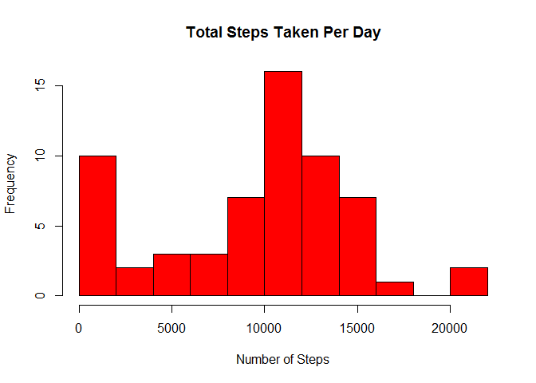
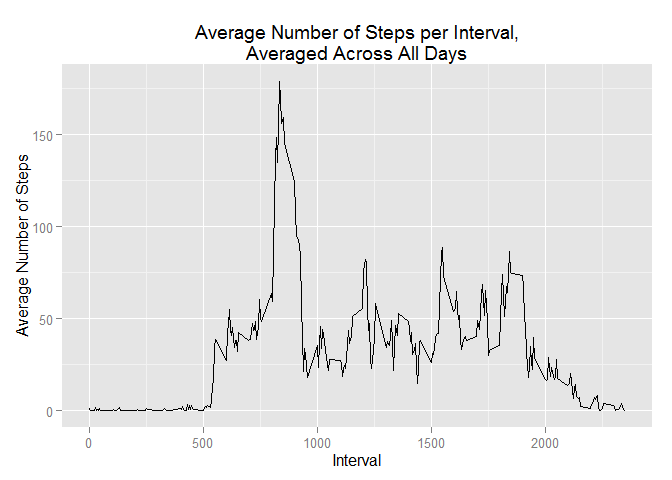
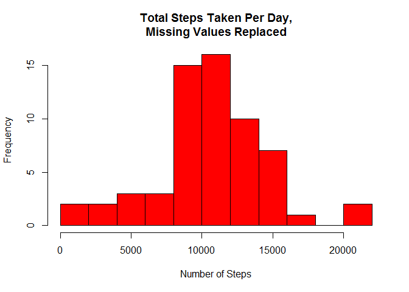
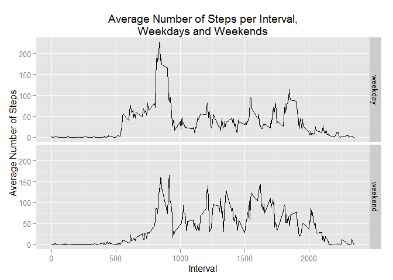

# Reproducible Research Course Project 1
January 9, 2016  

###Loading and preprocessing the data

1. Load the data (i.e. read.csv())


```r
unzip("repdata_data_activity.zip")
activity <- read.csv("activity.csv")
```

2. Process/transform the data (if necessary) into a format suitable for your analysis


```r
library(dplyr)

activity <- tbl_df(activity)
```

###What is mean total number of steps taken per day?

**For this part of the assignment, you can ignore the missing values in the dataset.**

1. Calculate the total number of steps taken per day


```r
totalsteps <- tapply(activity$steps, activity$date, sum, na.rm = TRUE)
```

2. If you do not understand the difference between a histogram and a barplot, research the difference between them. Make a histogram of the total number of steps taken each day


```r
hist(totalsteps, breaks = length(unique(totalsteps))/4, main = "Total Steps Taken Per Day",
     xlab = "Number of Steps", col = "red")
```

\

3. Calculate and report the mean and median of the total number of steps taken per day


```r
mean(totalsteps)
```

```
## [1] 9354.23
```

```r
median(totalsteps)
```

```
## [1] 10395
```

###What is the average daily activity pattern?

1. Make a time series plot (i.e. type = "l") of the 5-minute interval (x-axis) and the average number of steps taken, averaged across all days (y-axis)


```r
library(ggplot2)

by_interval <- group_by(activity, interval)
avg_by_interval <- summarize(by_interval, avgsteps = sum(steps, na.rm = TRUE)/length(unique(date)))

ggplot(avg_by_interval, aes(interval, avgsteps)) + geom_line() + labs(title = "Average Number of Steps per Interval,\nAveraged Across All Days", x = "Interval", y = "Average Number of Steps")
```

\

2. Which 5-minute interval, on average across all the days in the dataset, contains the maximum number of steps?


```r
arrange(avg_by_interval, desc(avgsteps))[1,]
```

```
## Source: local data frame [1 x 2]
## 
##   interval avgsteps
##      (int)    (dbl)
## 1      835 179.1311
```

Interval 835 contains the maximum number of steps on average.

###Imputing missing values

**Note that there are a number of days/intervals where there are missing values (coded as NA). The presence of missing days may introduce bias into some calculations or summaries of the data.**

1. Calculate and report the total number of missing values in the dataset (i.e. the total number of rows with NAs)


```r
sum(is.na(activity))
```

```
## [1] 2304
```

2. Devise a strategy for filling in all of the missing values in the dataset. The strategy does not need to be sophisticated. For example, you could use the mean/median for that day, or the mean for that 5-minute interval, etc.

Each missing steps value will be replaced with the mean value of steps for the 5-minute interval (rounded down). The mean values are rounded down so that all values reflect numbers of steps in whole numbers.

3. Create a new dataset that is equal to the original dataset but with the missing data filled in.


```r
#Gets the rounded means to fill the missing values with.

avg_by_interval_flr <- floor(avg_by_interval)

#Replicates the data set and separate out the rows with missing values.

activity_noNA <- activity
activity_noNA_incomplete <- subset(activity_noNA, is.na(steps) == TRUE)
activity_noNA_complete <- subset(activity_noNA, is.na(steps) == FALSE)

#Creates a function that will fill in each missing steps value according to its interval value.

fillNA <- function (x, ind) {
  for (i in as.numeric(rownames(ind))) {
    if (ind[i,1] == x) {
      fillval = ind[i,2] 
    }
  }
  return(fillval)
}

#Applies the function to all missing values.

activity_noNA_incomplete$steps <- sapply(activity_noNA_incomplete$interval, 
                                         fillNA, ind = avg_by_interval_flr)

#Compiles the new dataset with missing values filled in.

activity_noNA <- rbind(activity_noNA_complete, activity_noNA_incomplete)
sum(is.na(activity_noNA))
```

```
## [1] 0
```

4. Make a histogram of the total number of steps taken each day and Calculate and report the mean and median total number of steps taken per day. Do these values differ from the estimates from the first part of the assignment? What is the impact of imputing missing data on the estimates of the total daily number of steps?


```r
by_day_noNA <- group_by(activity_noNA, date)
totalsteps_noNA <- summarize(by_day_noNA, totalsteps = sum(as.numeric(steps)))

hist(totalsteps_noNA$totalsteps, breaks = length(unique(totalsteps_noNA$totalsteps))/4, 
     main = "Total Steps Taken Per Day,\nMissing Values Replaced", xlab = "Number of Steps", 
     col = "red")
```

\

```r
mean(totalsteps_noNA$totalsteps)
```

```
## [1] 10564.07
```

```r
median(totalsteps_noNA$totalsteps)
```

```
## [1] 10395
```

Comparing these results to previous results using data with missing values, we see that using the new data with missing values filled in, there are fewer days where the total number of steps taken is 0, and the mean goes up as a result. The median stays the same. 

\

```r
mean(totalsteps)
```

```
## [1] 9354.23
```

```r
median(totalsteps)
```

```
## [1] 10395
```

The previous results using data with missing values most likely exaggerated the number of days where the total number of steps taken was zero, because when all of the steps values for a particular day were missing, the sum of the available steps values for that day equaled zero using na.rm = TRUE, and thus the total number of steps taken for that day was made out to be zero. In this respect, missing steps values were treated as existing values that equaled zero.

###Are there differences in activity patterns between weekdays and weekends?

**For this part the weekdays() function may be of some help here. Use the dataset with the filled-in missing values for this part.**

1. Create a new factor variable in the dataset with two levels - "weekday" and "weekend" indicating whether a given date is a weekday or weekend day.


```r
activity_noNA$day <- weekdays(strptime(activity_noNA$date, format = "%Y-%m-%d"))
activity_noNA$weekday <- rep("weekday", length(activity_noNA$day))
activity_noNA$weekday[activity_noNA$day %in% c("Saturday", "Sunday")] <- "weekend"
```

2. Make a panel plot containing a time series plot (i.e. type = "l") of the 5-minute interval (x-axis) and the average number of steps taken, averaged across all weekday days or weekend days (y-axis). See the README file in the GitHub repository to see an example of what this plot should look like using simulated data.


```r
#Gets the numbers of weekday days and weekend days

unique_dates <- unique(activity_noNA$date)
unique_dates_weekday <- weekdays(strptime(unique_dates, format = "%Y-%m-%d"))
unique_weekend <- unique_dates_weekday[unique_dates_weekday %in% c("Saturday", "Sunday")]
numweekends <- length(unique_weekend)
numweekdays <- length(unique_dates_weekday) - numweekends

#Groups the activity data with missing values filled in by interval and the weekday/weekend factor variable

by_interval_noNA <- group_by(activity_noNA, interval, weekday)

#Gets the average number of steps taken per interval, averaged across weekday days for weekday data
#and averaged across weekend days for weekend data

sum_by_interval_noNA <- summarize(by_interval_noNA, sumsteps = sum(as.numeric(steps)))
sum_by_interval_noNA$num <- numweekdays
sum_by_interval_noNA$num[sum_by_interval_noNA$weekday == "weekend"] <- numweekends
sum_by_interval_noNA <- mutate(sum_by_interval_noNA, avgsteps = sumsteps/num)

#Produces panel plot

ggplot(sum_by_interval_noNA, aes(interval, avgsteps)) + 
  facet_grid(weekday ~ .) + 
  geom_line() + 
  labs(title = "Average Number of Steps per Interval,\nWeekdays and Weekends", 
       x = "Interval", y = "Average Number of Steps")
```

\
